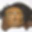

# Wgan For West-African Masks
Implementation of a Wasserstein GAN, for generating images of traditional west African masks, using TensorFlow. The architecture is based on that described in the paper, 'Using WGAN for Improving Imbalanced Classification Performance', by Bhatias and Dahyotr.

### Link to paper : 
http://ceur-ws.org/Vol-2563/aics_34.pdf

### Sample Images Generated:

### Run locally :
 1.Download and navigate to base directory.
 
 2.Run python3 gan_implementation_for_west_african_masks.py
### Run on Google CoLab:
 1.Open notebook and ensure tf.version 2.x
 
 2.Upload data_set.zip file and run.

### Generated Images At Each Epoch:

Epoch 0 : .jpg)

Epoch 50 : 

Epoch 500 : 

Epoch 1000 : 

Epoch 1500 : 

